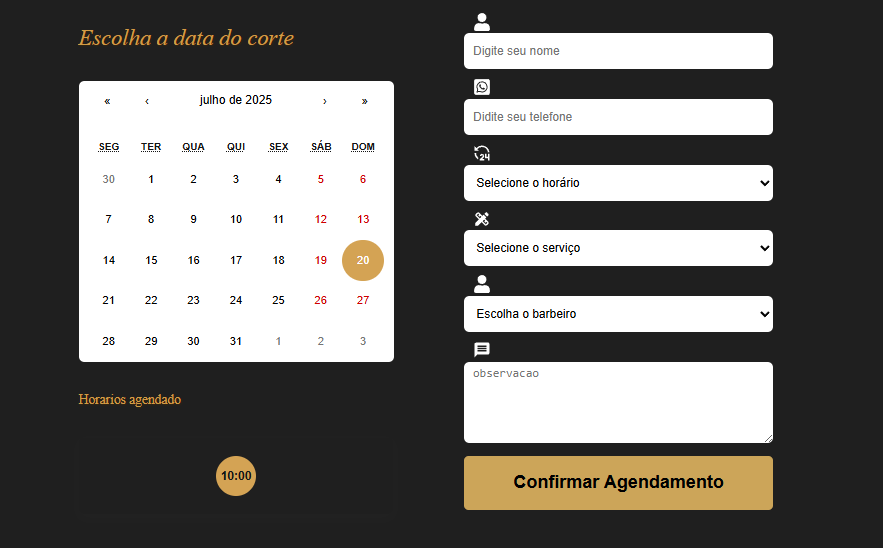

# DevBarbeShop 💈

💈 **Sobre o DevBarbeShop**  
DevBarbeShop é uma aplicação moderna de agendamento de cortes de cabelo com integração automatizada ao **n8n**. O sistema permite que clientes escolham datas e horários disponíveis, enviando as informações para uma automação que trata agendamento, verificação de disponibilidade, integração com Google Calendar, envio de confirmação e organização de histórico.

Ideal para barbearias que desejam automatizar seu atendimento e manter um controle eficiente dos agendamentos.

---

⚙️ **Funcionalidades**

- Agendamento de horários com formulário personalizado
- Verificação automática de conflitos no Google Calendar
- Registro e histórico de agendamentos
- Integração completa com **n8n** para automações (confirmação, registro e organização)
- Interface amigável e responsiva

---

## 🚀 Tecnologias

  
  
  
  

---

## 📌 Objetivo

Automatizar o processo de agendamento de cortes de cabelo, reduzindo erros manuais e otimizando a rotina de atendimento com um sistema visual, prático e com automações robustas.

---

## 🖼️ Imagens

---

## 🤝 **Agradecimentos**

Agradecimentos especiais ao **DevClub**, uma das maiores escolas de programação do Brasil, por compartilhar conhecimento e apoiar o crescimento de desenvolvedores(as).

---
